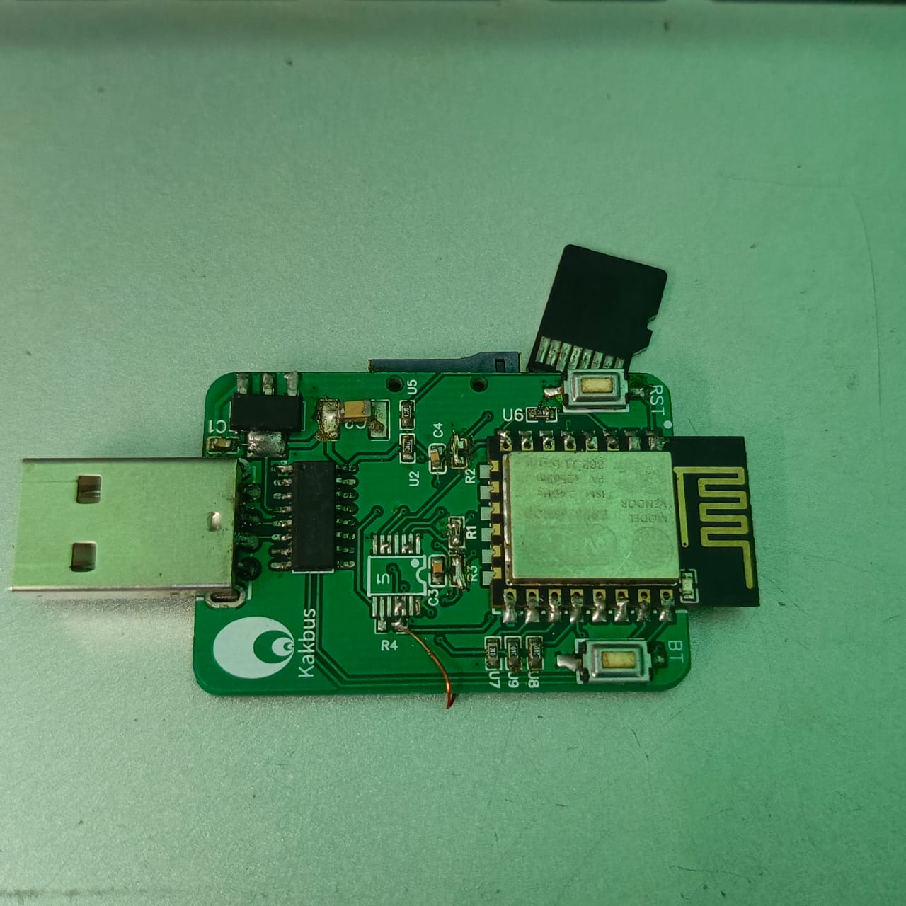
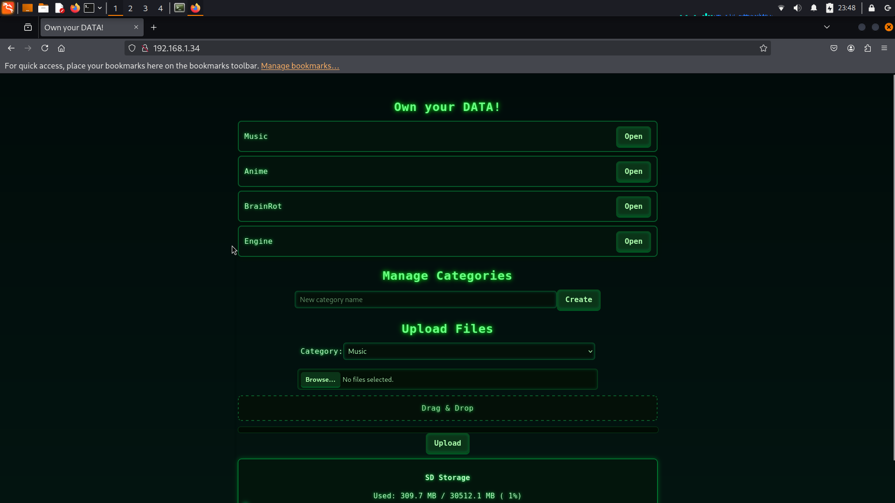
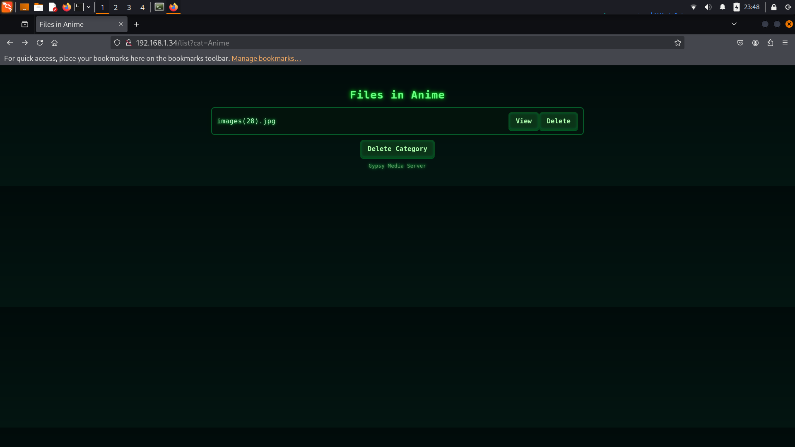
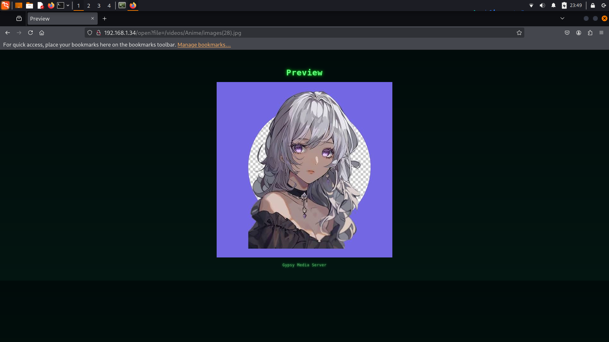

  
*A local file viewer built on the ESP8266*

**Gypsyv0** is a compact experiment in turning the humble **ESP8266** into a lightweight **local NAS-style file viewer**.  
It’s designed to serve files directly from an **SD card** or internal memory over Wi-Fi — no cloud, no dependencies, just you and your network.

The goal is simplicity: a small, self-contained board that can browse, read, and manage files locally through a web interface.

---

## What is here

- **Local file browsing** over Wi-Fi  
- **SD card (FAT32/MBR)** storage support   
- Runs standalone — powered via USB or external 5 V  or 3.3V
  
- Hardware layout inspired by the [WebStick project](https://github.com/tobychui/WebStick)

---

## Hardware

- **MCU:** ESP8266(12E)
- **Storage:** SD card(SPI MODE)  
- **Voltage Regulator AMS117 3.3V**
- **Ch340C USB TO TTL Converter chip**
- **Passive Components:** Resistor ,Capacitor

You can view the full schematic and PCB in the `usb_stick_kicadfiles/` folder (KiCad project).

---

##  What to do 

1. Flash gypsy.ino using Arduino IDE or PlatformIO.  
2. Open Serial Monitor to get the IP (eg 192.168.x.x)
3. Open in any browser on Computer or any device connected to that Network

---
## What you will see

Home Page

File viewing 

 
 Conetents

 
 Mp4 full screen view

## What i have seen SO FAR
- file uploading speed is Limited (average 150-250KB/s)
- Slower playing Larger files (greater than 50MB)
- but Good in MP3 handling , doesn't stuck (80KB of RAM is sufficient in ths case)

##  What I’m Exploring Next

- Network sharing (I have tested it Ngrok proxy tunneling to my friends , but ifmultiple people use at same time then it stops)  
- ESP32 port for faster WIFI throughput  
- Power optimization and case design( even smaller any small processor like Raspberry Pi Zero or ESP32 higher variant)
- Larger Video playback(cinema of Some Sort)

---

##  Feedback Wanted

This is still a **work in progress**, and I’d love your thoughts on:

- Firmware structure and web interface flow  
- PCB layout or power-handling tips  
- Ideas for extending it into a full mini NAS

If you’ve built anything similar — or see a way to make this smarter, faster, or cleaner — I’m all ears.

---

